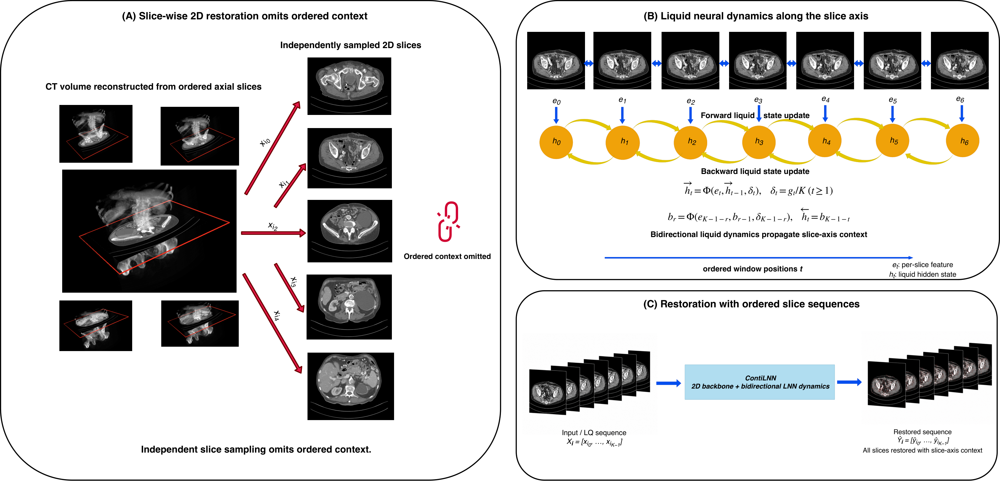
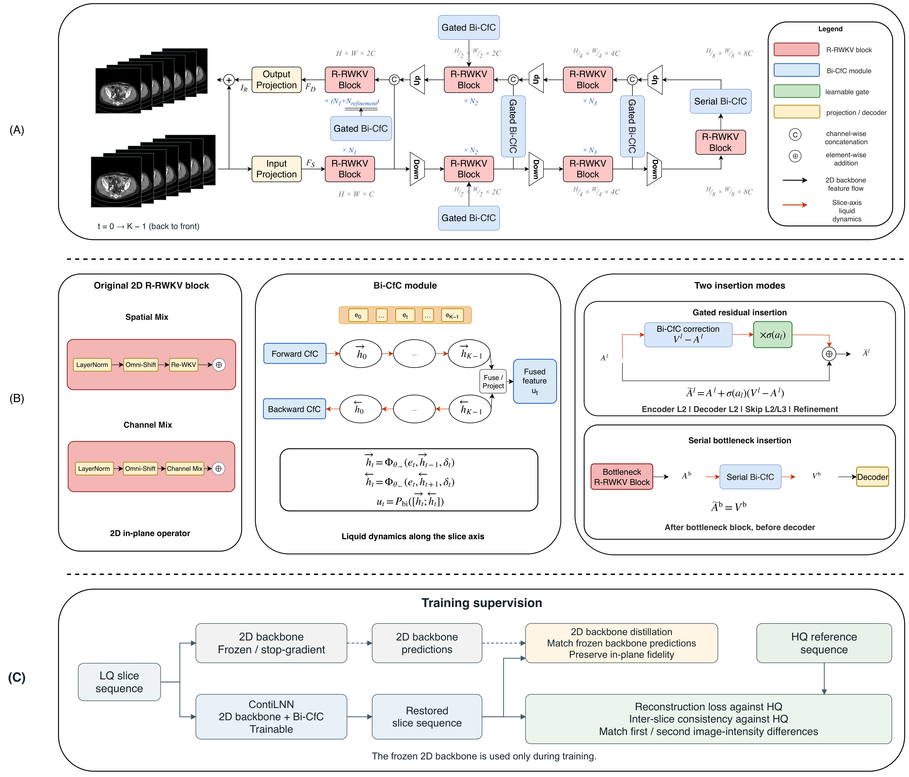
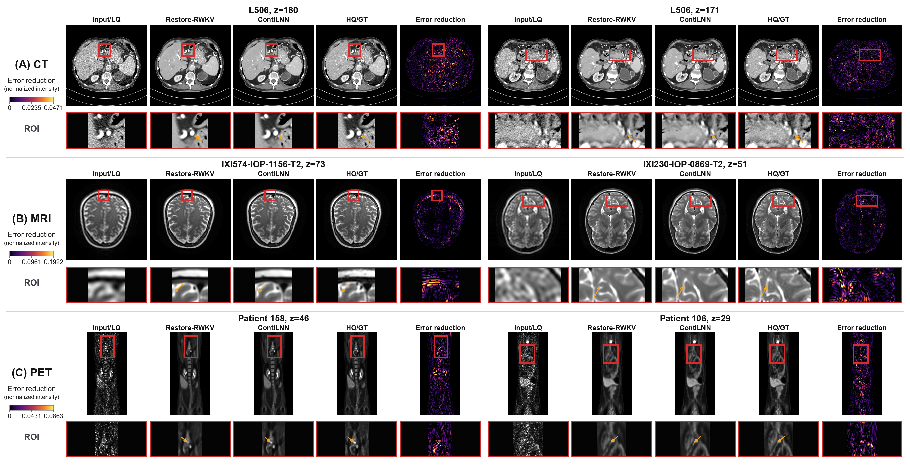

# ContiLNN

<!-- Editor: Jialei.He -->

Official code repository for
[**ContiLNN: Mitigating Slice Sampling Discontinuity with Liquid Neural Networks
for Medical Image Restoration**](https://arxiv.org/abs/2610.12337).

ContiLNN equips established two-dimensional medical-image restoration
backbones with position-aligned, bidirectional closed-form continuous-time
(CfC) dynamics along the ordered slice axis. It preserves the original
in-plane representation and produces one restored image for every observed
slice while incorporating anatomical context from both directions.

<p align="center">
  
</p>

<p align="center"><em>
Slice-wise 2D restoration omits ordered through-plane context. ContiLNN adds
bidirectional liquid dynamics along the slice axis while retaining a
position-aligned output at every observed slice.
</em></p>

## Method

For an ordered window of low-quality slices, a 2D backbone first extracts
in-plane representations independently at each position. Bi-CfC operators
then propagate selected feature sequences in forward and reverse slice order.
Normalized slice-index intervals condition the dynamics, and the two
directions are fused through a learned projection. Gated residual pathways
preserve the pretrained 2D representation; the deepest bottleneck uses serial
slice-axis processing.

<p align="center">
  
</p>

<p align="center"><em>
ContiLNN-RWKV architecture, the bidirectional CfC operator, the two insertion
modes, and training supervision using HQ references and a frozen 2D backbone.
</em></p>

This repository follows the order of the paper's primary experiments:

1. **ContiLNN-RWKV** for CT denoising, MRI super-resolution, and reduced-count
   PET restoration;
2. **ContiLNN-DASMamba** using the same modality-specific data and evaluation
   protocol.

## Results

The manuscript reports five-seed case-aggregated evaluation. Mean PSNR gains
over the corresponding independently evaluated 2D backbone are:

| Backbone integration | CT denoising | MRI super-resolution | PET restoration |
|---|---:|---:|---:|
| ContiLNN-RWKV | +0.1907 dB | +1.0176 dB | +1.2482 dB |
| ContiLNN-DASMamba | +0.1934 dB | +0.3604 dB | +1.1264 dB |

PSNR, structural similarity (SSIM), and root mean squared error (RMSE) are
computed per slice, averaged within each case, and then aggregated across
cases. The full mean and sample-standard-deviation results are reported in the
paper.

<p align="center">
  
</p>

<p align="center"><em>
Two examples per modality for CT, MRI, and PET, showing LQ inputs,
Restore-RWKV and ContiLNN outputs, HQ references, and error-reduction maps
with enlarged local regions. Brighter colors indicate larger positive
reductions in absolute error relative to Restore-RWKV, measured in
normalized display intensity; error increases are clipped to zero.
</em></p>

## Pretrained models

| Model | CT | MRI | PET |
|---|---|---|---|
| ContiLNN-RWKV | [Download](https://github.com/Noah-hjl/ContiLNN/releases/download/pretrained-v1/ContiLNN_RWKV_CT.pth) | [Download](https://github.com/Noah-hjl/ContiLNN/releases/download/pretrained-v1/ContiLNN_RWKV_MRI.pth) | [Download](https://github.com/Noah-hjl/ContiLNN/releases/download/pretrained-v1/ContiLNN_RWKV_PET.pth) |
| ContiLNN-DASMamba | [Download](https://github.com/Noah-hjl/ContiLNN/releases/download/pretrained-v1/ContiLNN_DASMamba_CT.pth) | [Download](https://github.com/Noah-hjl/ContiLNN/releases/download/pretrained-v1/ContiLNN_DASMamba_MRI.pth) | [Download](https://github.com/Noah-hjl/ContiLNN/releases/download/pretrained-v1/ContiLNN_DASMamba_PET.pth) |

Each checkpoint contains the complete backbone and Bi-CfC modules. Save the
downloaded files in `checkpoints/` and use the matching modality in the
evaluation commands below.

## Repository organization

```text
ContiLNN/
├── assets/                    # repository figures
├── configs/
│   ├── 01_rwkv_main/          # ContiLNN-RWKV protocol
│   └── 02_dasmamba_transfer/  # ContiLNN-DASMamba protocol
├── environments/              # top-level Conda environments
├── src/contilnn/
│   ├── data/                  # isolated CT, MRI, and PET readers
│   ├── evaluation/            # case-complete inference and metrics
│   ├── models/                # Bi-CfC and the two backbone integrations
│   └── training/              # objective and Stage-B training engine
├── tests/                     # CPU-compatible regression tests
└── docs/                      # data protocol and source provenance
```

## Installation

The two backbone integrations use different reference toolchains. For
ContiLNN-RWKV:

```bash
conda env create -f environments/environment-rwkv.yml
conda activate contilnn-rwkv
```

For ContiLNN-DASMamba:

```bash
conda env create -f environments/environment-dasmamba.yml
conda activate contilnn-dasmamba
python -m pip install --no-build-isolation causal-conv1d==1.4.0 mamba-ssm==2.2.2
```

Use the pinned DASMamba source revision documented in
[`docs/SOURCE_PROVENANCE.md`](docs/SOURCE_PROVENANCE.md):

```bash
git clone https://github.com/cc111mp/DASMamba-MedIR.git ../DASMamba-MedIR
git -C ../DASMamba-MedIR checkout 8baea1839d800563a1670bb27410509aa7fcbf28
export PYTHONPATH="$(cd ../DASMamba-MedIR && pwd)${PYTHONPATH:+:$PYTHONPATH}"
```

The Restore-RWKV WKV extension is compiled on its first CUDA execution. Set
`CONTILNN_CUDA_ARCH=80` when an explicit compute capability is required for an
NVIDIA A800 or A100 build.

## Data

Medical-image data are not distributed with this repository. The expected
layout is:

```text
DATA_ROOT/
├── CT/{train,validation,test}/{LQ,HQ}/...
├── MRI/{train,validation,test}/{LQ,HQ}/...
└── PET/{train,validation,test}/{LQ,HQ}/...
```

The three modalities deliberately use separate readers and filename parsers:

- CT: `L<case>_<slice>[_<patch>]`;
- MRI: `IXI...-(Guys|HH|IOP)-...-T2_<slice>`;
- PET: `Patient_<case>_<slice>[_<patch>]`.

Patient-level splitting precedes ordered-window construction. Readers reject
cross-modality filename grammars instead of silently falling back to another
parser. Cohort counts, normalization, short-tail handling, and case-first
metric aggregation are described in
[`docs/DATA_PROTOCOL.md`](docs/DATA_PROTOCOL.md).

Checkpoint files and pickled `.bin` arrays are deserialized by PyTorch and
Python, respectively. Use only files obtained from trusted sources.

## Command-line workflow

The installed `contilnn` command exposes protocol inspection, Stage-B
training, and case-complete evaluation.

### 1. Inspect a protocol

```bash
contilnn inspect-protocol --protocol rwkv
contilnn inspect-protocol --protocol dasmamba
```

### 2. Train ContiLNN-RWKV

Stage B starts from a validation-selected Restore-RWKV Stage-A checkpoint:

```bash
contilnn train \
  --protocol rwkv \
  --data-root /path/to/data \
  --modality PET \
  --stage-a-checkpoint /path/to/Generator_best.pth \
  --output-dir runs/rwkv_pet \
  --seed <SEED> \
  --device cuda
```

The run writes the validation-selected `best.pth` and `history.csv`. The public
training entry point covers one complete Stage-B run initialized from the
selected Stage-A checkpoint.

For `torchrun`-based distributed training, invoke the same command through the
module entry point:

```bash
torchrun --standalone --nproc-per-node=<GPUS> -m contilnn.cli train \
  --protocol rwkv \
  --data-root /path/to/data \
  --modality PET \
  --stage-a-checkpoint /path/to/Generator_best.pth \
  --output-dir runs/rwkv_pet \
  --seed <SEED> \
  --device cuda
```

### 3. Train ContiLNN-DASMamba

The upstream DASMamba model is supplied as a zero-argument Python factory.
Because the external backbone package determines its construction, the CLI
requires optimizer values explicitly when they are not fixed in the protocol:

```bash
contilnn train \
  --protocol dasmamba \
  --data-root /path/to/data \
  --modality PET \
  --stage-a-checkpoint /path/to/dasmamba_best.pth \
  --backbone-factory model.DASMamba:DASMamba \
  --output-dir runs/dasmamba_pet \
  --seed <SEED> \
  --learning-rate-base <LR> \
  --learning-rate-operator <LR> \
  --learning-rate-gate <LR> \
  --learning-rate-end <LR> \
  --weight-decay <VALUE> \
  --gradient-clip-norm <VALUE> \
  --device cuda
```

### 4. Evaluate a pretrained model

For ContiLNN-RWKV:

```bash
contilnn evaluate \
  --protocol rwkv \
  --data-root /path/to/data \
  --modality PET \
  --split test \
  --checkpoint checkpoints/ContiLNN_RWKV_PET.pth \
  --output-dir results/rwkv_pet \
  --device cuda
```

For ContiLNN-DASMamba:

```bash
contilnn evaluate \
  --protocol dasmamba \
  --backbone-factory model.DASMamba:DASMamba \
  --data-root /path/to/data \
  --modality PET \
  --split test \
  --checkpoint checkpoints/ContiLNN_DASMamba_PET.pth \
  --output-dir results/dasmamba_pet \
  --device cuda
```

For CT or MRI, change `--modality` and select the corresponding checkpoint.
To evaluate a model trained with this repository, use its `best.pth` instead.

Evaluation covers every real slice using overlapping windows with the two
paper-defined offsets. It writes `per_slice.csv`, `per_case.csv`, and
`summary.json`.

## Verification

CPU-compatible tests can be run without medical data or model weights:

```bash
python -m unittest discover -s tests -v
```

The tests cover modality-specific filename parsing and reader isolation,
protocol consistency, objective and metric calculations, checkpoint format,
and command-line orchestration.

## License and attribution

This repository is distributed under the Apache License 2.0. Restore-RWKV
files retain their upstream Shanghai AI Laboratory notice, and DASMamba
remains a pinned external dependency. See [`NOTICE`](NOTICE),
[`THIRD_PARTY_NOTICES.md`](THIRD_PARTY_NOTICES.md), and
[`docs/SOURCE_PROVENANCE.md`](docs/SOURCE_PROVENANCE.md).
